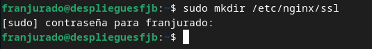
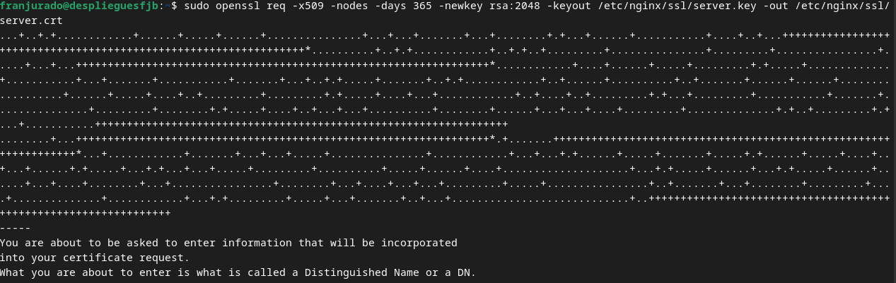
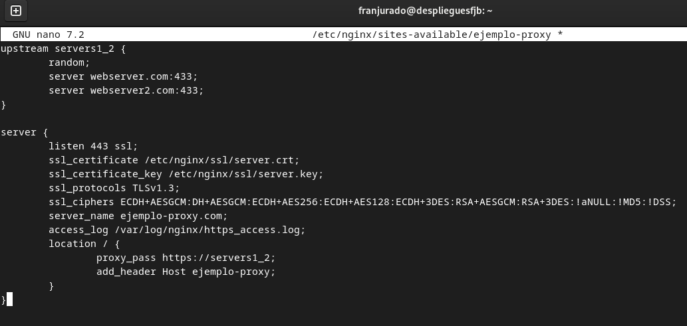
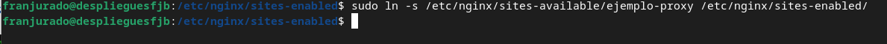
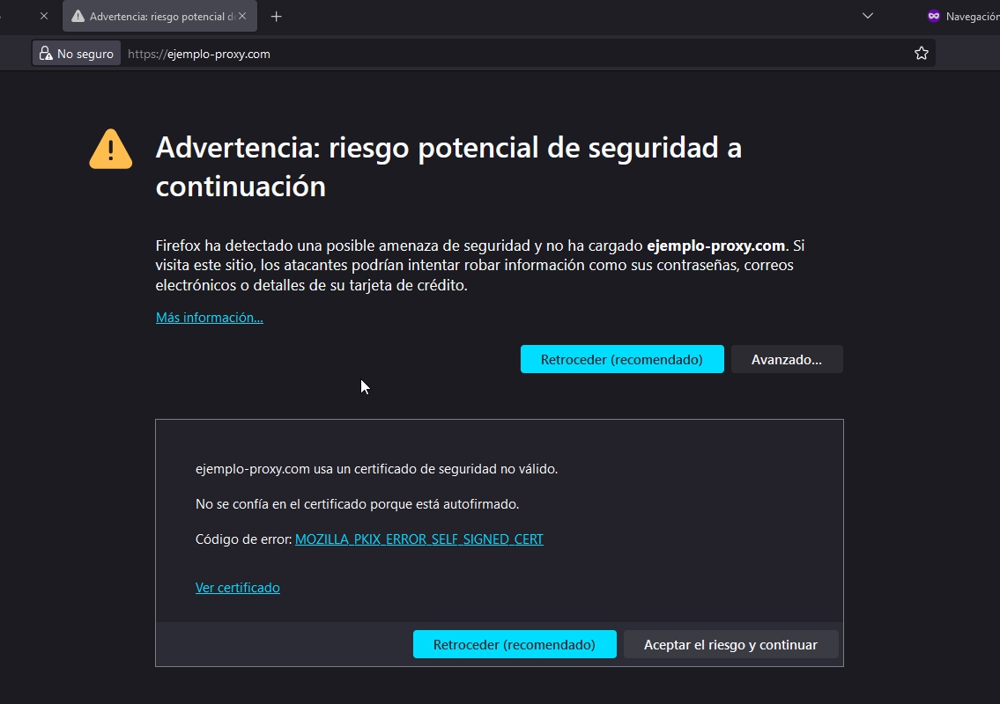
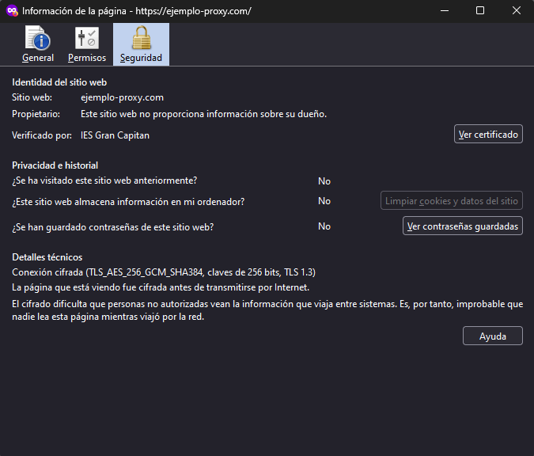
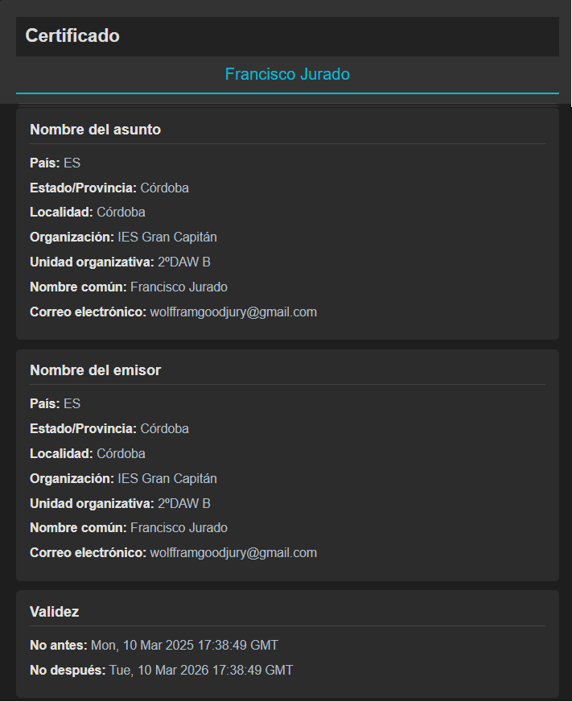
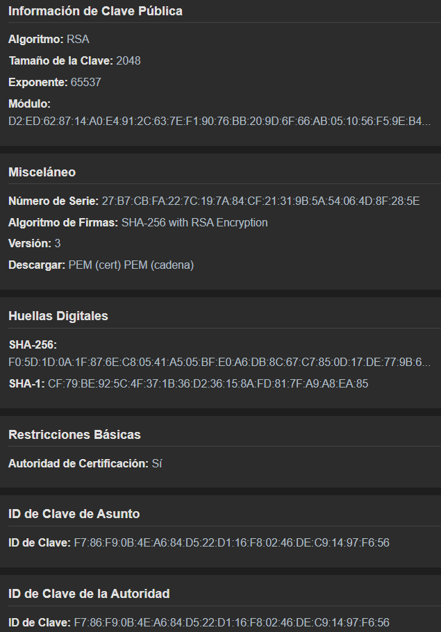
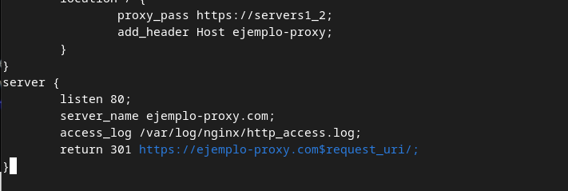

# Practica 2.5: Proxy Inverso y Balanceo de Carga con SSL en NGINX

## Índice
- [Creación de Certificado Autofirmado](#creación-de-certificado-autofirmado)
- [Configuración SSL en el Proxy Inverso](#configuración-ssl-en-el-proxy-inverso)
- [Comprobaciones](#comprobaciones)
- [Redirección Forzosa a HTTPS](#redirección-forzosa-a-https)
- [Cuestiones Finales](#cuestiones-finales)

## Creación de Certificado Autofirmado
Para esta práctica vamos a necesitar un certificado SSL autofirmado. Un certificado autofirmado es un certificado de servidor que es firmado por la propia entidad que lo emite. En lugar de confiar en una entidad de certificación (CA) de confianza, los certificados autofirmados son firmados por la misma persona que los emite. Por lo tanto, no son confiables y no se pueden verificar automáticamente.

En un entorno de producción, siempre debe utilizar un certificado SSL firmado por una CA de confianza. Sin embargo, para fines de desarrollo y pruebas, un certificado autofirmado es una buena opción.

Se creará una carpeta en `/etc/nginx/ssl` donde se almacenarán los certificados y las claves asociadas a ellos (privada/pública).

Veamos pues el proceso para generar los certificados y las claves asociadas a ellos (privada/pública). En primer lugar debemos crear el siguiente directorio:

```bash
sudo mkdir -p /etc/nginx/ssl
```




Una vez creado el directorio, se ejecutará el siguiente comando:

```bash
sudo openssl req -x509 -nodes -days 365 -newkey rsa:2048 -keyout /etc/nginx/ssl/server.key -out /etc/nginx/ssl/server.crt
```



## Configuración SSL en el Proxy Inverso
Hecho esto, se procederá a configurar nuestro proxy-inverso. Para ello se deberán de realizar los siguientes pasos:

1. Editar el archivo de configuración del proxy-inverso.
2. Hacer un `unlink` de este en la carpeta `sites-enabled`.
3. Agregar la configuración para que acepte los certificados en `sites-enabled`.

El archivo de configuración deberá de quedar de la siguiente manera:




Se ejecutará el siguiente comando para hacer un `unlink` del archivo de configuración en la carpeta `sites-enabled`:


Se ejecutará el siguiente comando para hacer un `link` del archivo de configuración en la carpeta `sites-enabled`:

```bash
sudo ln -s /etc/nginx/sites-available/ejemplo-proxy /etc/nginx/sites-enabled/
```



## Comprobaciones
Las comprobaciones se deberán hacer desde un navegador externo, en el cual accederemos a `ejemplo-proxy.com`. Para ello, se deberá tener activa una máquina de webserver.



Una vez dentro, haremos clic en "Aceptar el riesgo y continuar" para proceder con la redirección. Lo importante es verificar si los certificados están correctamente configurados, para ello, haremos clic en el icono del candado ubicado junto a la barra de direcciones de nuestro navegador.



A continuación, veremos la configuración. Debemos acceder a la sección de ver certificado, donde se mostrará toda la configuración junto con las claves.





Como se puede observar, el certificado está correctamente configurado y es válido.

## Redirección Forzosa a HTTPS
Para forzar la redirección a HTTPS, se deberá de modificar el archivo de configuración del proxy-inverso. Se deberá de agregar la siguiente configuración:



Una vez hecho esto, se deberá de reiniciar el servicio de nginx:

```bash
sudo systemctl restart nginx
```

Para comprobar que la redirección a HTTPS está funcionando correctamente, se deberá de acceder a nuestro sitio web y verificar que la redirección se ha realizado correctamente.

## Cuestiones Finales

### Cuestión 1
Hemos configurado nuestro proxy inverso con todo lo que nos hace falta pero no nos funciona y da un error del tipo `This site can't provide a secure connection, ERR_SSL_PROTOCOL_ERROR`.

Para resolver el error `ERR_SSL_PROTOCOL_ERROR`, se asegurará de que el `server_name` coincida con el dominio utilizado para acceder al sitio. Se verificará que el certificado y la clave SSL estén en la ubicación correcta y tengan los permisos adecuados. Además de TLS 1.3, se utilizará una lista de cifrados más amplia como `ssl_ciphers HIGH:!aNULL:!MD5`, y se confirmará que el servicio en `proxy_pass` sea accesible desde NGINX. Después de estos ajustes, se reiniciará NGINX y se revisarán los logs para identificar posibles problemas adicionales.

### Cuestión 2
Imaginad que intentamos acceder a nuestro sitio web HTTPS y nos encontramos con el siguiente error:

El error `NET::ERR_CERT_REVOKED` significa que el certificado SSL fue revocado y ya no es confiable. Para solucionarlo, se obtendrá un nuevo certificado SSL, se configurará el servidor para usarlo y se reiniciará el servidor. Luego, se verificará que el error se haya solucionado accediendo al sitio.